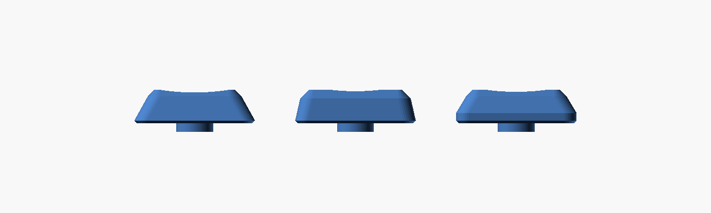
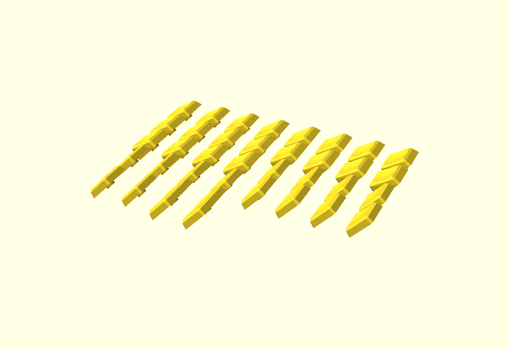

# KLP Lamé Angular (OpenSCAD)


KLP Lamé の特徴である「中央がくぼみ四辺が持ち上がる皿状の天面(前後のロールオフ)」を
保ちつつ、側面を**フラットで角のはっきりした台形**にした **角ばった・低背リミックス** です。
天面は元と同じ球面ディッシュ、側面はフラット、稜線だけを軽く丸めた「ラウンデッドボックス」構成。
OpenSCAD 製のフルパラメトリックモデルなので、寸法・形状を自由に調整できます。

An angular, lower-profile remix of KLP Lamé. Flat, crisp trapezoid
sides (a "rounded box" with only the perimeter edges softened) carry
the same spherical dish as the original — concave scoop rising toward
all four edges, rolling off over the front/back walls. Fully parametric
OpenSCAD source. Stem and cavity dimensions are measured from the
original STLs, so switch fit is identical to the originals.

## 特徴 / Features

- **角ばった形状** — 側面はフラット、稜線のみ軽い丸め
- **詰めた間隔** — 19.05mm ピッチ向けに底面 18.5×18.5mm。
  キー間はリムで 0.55mm、天面どうしで 2.05mm
- **皿状の天面は維持** — 元と同じ球面ディッシュ(中央がくぼみ四辺へ持ち上がる)。
  Tilted は 15° 傾斜。前端をホーム段と同じ高さにして段差なくつなげています
- **低背化** — クラウン高さ 5.0 mm(オリジナル約 5.6 mm より低い)、
  指の当たる谷底は約 3.9 mm
- **互換ステム** — Choc(2本足 1.15×2.95、間隔5.7)/ MX(Ø5.5 ボス+十字)
  はオリジナル実測値そのまま
- **サポート不要で印刷できる形状** — 外殻に 45° を超える面がありません
  (下記「オーバーハング」)

## バリアント / Variants

4 種 × ステム(Choc/MX) × サイズ(Choc 17.5×16.5 / MX 18×18 / MX Tight 18.5×18.5):

| Variant | 説明 |
| :--- | :--- |
| Normal | 皿状のくぼみを持つ基本形 |
| Normal Homing | Normal+ホーミングバー |
| Normal Tilted | 15° 傾斜(上下段用) |
| 1.5U Normal | Normal の 1.5U 幅版(親指用) |

ビルド済み STL は `STL/` 以下(`build.sh` で再生成できます)。
ホーミングは `homing = "dots"` でオリジナル風の3点バンプにも変更可能です。

## サイズ / Footprint sizes

| `size_type` | 底面 | 想定ピッチ | リムの隙間 |
| :--- | :--- | :--- | :--- |
| choc | 17.5 × 16.5 | 18 / 17 mm | 0.5 mm |
| mx | 18 × 18 | 19 mm | 1.0 mm |
| **mx_tight**(c4mtb 用) | **18.5 × 18.5** | **19.05 mm** | **0.55 mm** |

`mx_tight` は Corne v4 Mini 実測の 19.05mm ピッチに合わせた詰めた版です。
底面を 0.5mm 広げただけで側面の傾きは変えていないので、天面も 16.5 → 17.0mm
に広がり、天面どうしの隙間が 2.5 → 2.05mm に詰まります。

## 側面スタイル / Sidewall styles

キー間の隙間をどれだけ詰めるかを `side_style` で選べます(`mx_tight` の場合):

| スタイル | 側面 | 天面 | 天面どうしの隙間 |
| :--- | :--- | :--- | :--- |
| **chiclet**(既定) | ほぼ垂直(約11°) | 17.0×17.0 | 2.05 mm |
| wide | 従来のテーパー(約27°) | 14.5×14.5 | 4.55 mm |
| skirt | 下1.5mmは垂直、その上テーパー | 15.5×15.5 | リム0.55 / 上3.55 mm |



## 傾斜 / Tilt

Tilted は前端の footprint 辺を軸に 15° 起こします。回転軸の高さが
`tilt_front_height` = `crown_height` なので、**前端はホーム段のクラウンと同じ 5.0mm**、
そこから後方へ向かって持ち上がり、後端のクラウンはリムから 9.3mm になります。

上段はそのまま、下段は 180° 回して置くと、3段が一つの浅いボウルになります。
`tilt_angle` を上げるぶんだけ後端が `cap_d × sin(tilt)` 高くなるので、
高さを抑えたいときは `tilt_front_height` を下げてください
(ただしホーム段との間に段差ができます)。

## Corne v4 Mini 印刷セット / Print set

[c4mtb](https://github.com/iwmsl/c4mtb)(Corne v4 Mini 相当)向けの
**両手36キー一式**を、Bambu Lab A1 mini(180×180mm)にそのまま並べた
プレートを用意しています(`MX Stem + MX Tight Size`)。詳細は
[Plates/README.md](./Plates/README.md)。

| ファイル | 向き | 特徴 |
| :--- | :--- | :--- |
| **`Plates/Plate_A1mini_Corne36_Tipped.stl`**(推奨) | **上向きから48°傾ける** | **36キー一括・サポート不要。外殻に45°超の面なし(最大42°)。天面の積層痕も出ません** |
| `Plates/Plate_A1mini_Corne36_BottomDown.stl` | 上向き(底面を下) | サポート必須(リム下と空洞内)。天面に同心円状の積層痕が出ます |
| `Plates/Plate_A1mini_Test_OneEach_RearSideDown.stl` | 側面を下 | 全4種を各1個。8mmブリム推奨 |

36キー版の内訳: Normal Tilted×20 / Normal×12(ホーム段8＋1U親指4) /
Normal Homing×2 / 1.5U Normal×2 = 36。



## オーバーハング / Overhang

`overhang.py` が組み上がった STL を読み、指定の向きに傾けて
「45° を超える面がどこに何 mm² あるか」を出します。キャップは
**外殻**(壁・リム下面・天面。ここが崩れると印刷が失敗する)と
**内側**(空洞・天井・ステム。スイッチに隠れ、崩れても効くのは嵌合だけ)
に分けて集計します。

```sh
python3 overhang.py --tip=48 "STL/MX Stem + MX Tight Size/"*.stl
python3 overhang.py --sweep "STL/MX Stem + MX Tight Size/MX_Stem_MX_Tight_Size_Angular_Normal.stl"
```

傾ける角度は、キャップの**水平面**(リム下面と空洞の天井、合わせて約340mm²)と
**垂直面**(十字穴の側壁)を天秤にかけます。前者は「90° − 傾き」、後者は「傾き」に
なり、和が常に 90° なので、どちらか一方は必ず 45° 以上になります。
面積の大きい外側に余裕を持たせるのが正解で、48° がその最良点です。

| 傾き | 外殻の最大角 | 外殻の45°超 | 内側の45°超 |
| --: | --: | --: | --: |
| 45° | 45.0° | 65.9 mm² | 157.1 mm² |
| 46° | 44.0° | 0.0 mm² | 15.1 mm² |
| **48°** | **42.0°** | **0.0 mm²** | **15.9 mm²** |
| 50° | 43.0° | 0.0 mm² | 17.2 mm² |
| 52° | 45.0° | 130.3 mm² | 20.3 mm² |

残る 15.9mm² は Ø5.5 ボスの中に彫られた幅 1.2mm の十字穴の側壁で、
スイッチに隠れるうえ左右の壁がすぐ繋がるブリッジです。

この形になるまでに直した点:

- **空洞を外向きテーパーに** — 空洞が上へ行くほど狭まっていた頃、その壁は
  32mm² にわたって 80° という、モデル中で断然最悪の面でした。逆向きに
  テーパーを付けて壁を空洞から離す向きに倒すと、そのまま自立面になります。
  スイッチ側は上へ行くほど細くなるので、嵌合には影響しません。
  リムの壁が厚い `mx_tight` だけがこのテーパーを取れる余裕を持っており、
  choc / mx サイズは壁厚を優先して垂直な空洞になります(45°超は残りますが、
  かつての 80° ではなく傾き角そのもの＝48°です)
- **ステム入口のテーパーをザグリに** — 円錐状の面取りは四方すべてが
  空洞側に倒れ込むので、傾けると 80° に達していました。段差にしても
  面取り済みの MX ステムなら問題なく入ります
- **ボスをテーパーに** — リムより上は switch に入らないので自由に倒せます
- **リムの継ぎ目を除去** — `bottom_edge_round = 0` のとき hull の底が二重に
  なり、0.01mm だけ完全垂直な帯が残っていました

## 使い方 / Usage

### OpenSCAD GUI(カスタマイザ)

`klp-lame-angular.scad` を開いて Customizer からパラメータを変更し、
F6 → STL エクスポート。主なパラメータ:

| パラメータ | 既定値 | 説明 |
| :--- | :--- | :--- |
| `stem_type` | choc | choc / mx |
| `size_type` | choc | choc / mx / mx_tight(上表参照) |
| `variant` | normal | normal / tilted |
| `homing` | none | none / bar / dots |
| `crown_height` | 5.0 | クラウン(天面の外周稜線)の高さ ※ |
| `dish_depth` | 1.15 | 中央のくぼみ深さ。谷底 = `crown_height` − `dish_depth` |
| `dish_radius` | 28 | 球面ディッシュのR(小さいほど深く丸い皿) |
| `side_style` | chiclet | chiclet / wide / skirt(上表参照) |
| `corner_radius` | 1.9 | 底面の角R(小さいほど角ばる) |
| `cavity_flare` / `wall_min` | 0.25 / 0.6 | 空洞を上へ向けて片側 `cavity_flare` だけ広げる(印刷時に自立させるため)。ただし天井での壁厚が `wall_min` を下回らない範囲まで。リムの壁厚はサイズごとに自動(mx_tight 1.25 / その他 1.0mm)で、空洞の口はオリジナルと同寸です |
| `tilt_angle` / `tilt_front_height` | 15 / 5.0 | Tilted の傾斜角と前端高さ。前端＝`crown_height` でホーム段と段差なし |

※ 谷底(`crown_height` − `dish_depth`)− 空洞深さ(約2.0)が天板の最小厚です。
既定値で約 1.85 mm。FDM なら 1.0 mm 以上を推奨します。

### CLI

```sh
# 単品
openscad -o cap.stl -D 'stem_type="mx"' -D 'size_type="mx_tight"' -D 'variant="tilted"' klp-lame-angular.scad

# 全24種 + プレート + オーバーハング検査 + プレビュー画像
./build.sh
```

## Bambu Lab A1 mini での印刷 / Printing

**上向きから48°傾けて、サポートなしで印刷するのを推奨します。**

- ノズル: 0.4 mm / レイヤー: 0.08–0.12 mm
- 壁: 4 以上、インフィル: 100%(小さい部品なのでほぼ変わりません)
- 向き: 48°傾け(推奨)。**サポート不要**。ブリムは3mm程度
- 試作プレート: 接地面が小さいため8mmブリム推奨
- 材料: PLA / PETG(テクスチャPEIプレート)
- シーム: 後方に寄せる(Seam position: Rear)
- はめ合いがきつい/ゆるい場合: Bambu Studio の
  「X-Y hole compensation」を ±0.05 mm 程度調整するか、
  scad の `choc_leg_w` / `mx_slot_v` などを直接調整

レジン印刷でも問題ありません。

## クレジット / Credit

Original KLP Lamé by [braindefender](https://github.com/braindefender/KLP-Lame-Keycaps).
This remix follows the same license — keep the credit to the original author.
