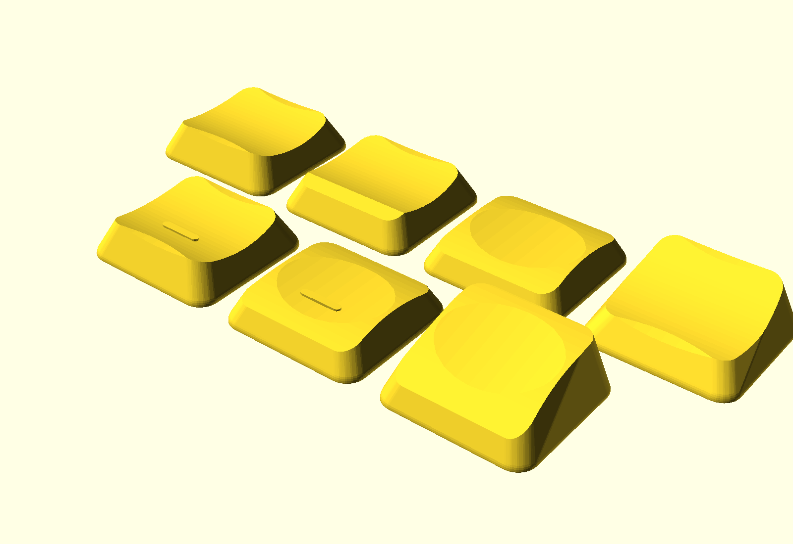

# KLP Lamé Angular (OpenSCAD)



KLP Lamé の特徴である「上下(前後)に持ち上がるリップとくぼんだ天面」を保ちつつ、
側面をフラットな台形にした **角ばった・低背リミックス** です。
エッジ全体に大きめのフィレット(R1.4)が入った、柔らかい面構成になっています。
OpenSCAD 製のフルパラメトリックモデルなので、寸法・形状を自由に調整できます。

An angular, lower-profile remix of KLP Lamé, keeping the signature
front/back winged lips and dished top, with generously filleted edges.
Fully parametric OpenSCAD source. Stem and cavity dimensions are
measured from the original STLs, so switch fit is identical to the
originals.

## 特徴 / Features

- **角ばった形状** — 側面はフラットな台形、全エッジに R1.4 のフィレット
- **傾斜は維持** — 深いシリンドリカルな谷が天面全体を覆い、
  前後のリップが側面シルエットより翼状に立ち上がる(オリジナルと同じ造形言語)。
  Tilted の 15° 傾斜もそのまま
- **低背化** — 指が乗る谷底がオリジナルより約 0.35 mm 低い
  (MX Normal: 3.5 → 3.15 mm)、Tilted は最大高さ約 7.8 → 6.6 mm
- **互換ステム** — Choc(2本足 1.15×2.95、間隔5.7)/ MX(Ø5.5 ボス+十字)
  はオリジナル実測値そのまま
- **FDM向け** — Bambu Lab A1 mini でのプリントを想定(内側ボトムチャンファ付き)

## バリアント / Variants

オリジナルと同じ 7 種 × ステム(Choc/MX) × サイズ(Choc 17.5×16.5 / MX 18×18):

| Variant | 説明 |
| :--- | :--- |
| Normal | フラット+浅いくぼみ |
| Normal Homing | Normal+ホーミングバー |
| Normal Tilted | 15° 傾斜 |
| Thumb | 手前側を斜めにカット(親指用) |
| Saddle | 前後に丸く落ちる鞍型 |
| Saddle Homing | Saddle+ホーミングバー |
| Saddle Tilted | Saddle の 15° 傾斜版 |

ビルド済み STL は `STL/` 以下(`build.sh` で再生成できます)。
ホーミングは `homing = "dots"` でオリジナル風の3点バンプにも変更可能です。

## 使い方 / Usage

### OpenSCAD GUI(カスタマイザ)

`klp-lame-angular.scad` を開いて Customizer からパラメータを変更し、
F6 → STL エクスポート。主なパラメータ:

| パラメータ | 既定値 | 説明 |
| :--- | :--- | :--- |
| `stem_type` | choc | choc / mx |
| `size_type` | choc | choc (17.5×16.5) / mx (18×18) |
| `variant` | normal | normal / tilted / thumb / saddle / saddle_tilted |
| `homing` | none | none / bar / dots |
| `cap_height` | 5.0 | クラウン(くぼみを彫る前の頂面)の高さ ※ |
| `dish_depth` | 1.85 | 谷の深さ。谷底 = `cap_height` − `dish_depth` |
| `dish_radius` | 18 | 谷のR。小さいほどリップの立ち上がりが強い |
| `cross_dish_depth` | 1.0 | リップ中央の落とし込み量 |
| `edge_fillet` | 1.4 | 全エッジのフィレットR(0 でエッジの立った造形に) |
| `top_inset` | 1.75 | 側面の傾き(1辺あたりの天面の縮み) |
| `corner_radius` | 2.2 | 底面の角R(小さいほど角ばる) |
| `tilt_angle` | 15 | Tilted の傾斜角 |

※ 谷底(`cap_height` − `dish_depth`)− 空洞深さ(約2.0)が天板の最小厚です。
既定値で約 1.15 mm。FDM なら 1.0 mm 以上を推奨します。

### CLI

```sh
# 単品
openscad -o cap.stl -D 'stem_type="choc"' -D 'variant="saddle"' klp-lame-angular.scad

# 全28種 + プレビュー画像
./build.sh
```

## Bambu Lab A1 mini での印刷 / Printing

側面がフラットなので **横倒し(左右どちらかの側面を下)** が印刷しやすく、
天面の積層痕も目立ちにくいです。オリジナル同様の 45° 傾けでも構いません。

- ノズル: 0.4 mm / レイヤー: 0.08–0.12 mm
- 壁: 4 以上、インフィル: 100%(小さい部品なのでほぼ変わりません)
- 向き: 側面を下にして横倒し(サポートはステム足周辺のみ、ツリーサポート推奨)
- 材料: PLA / PETG(テクスチャPEIプレート)
- シーム: 後方に寄せる(Seam position: Rear)
- はめ合いがきつい/ゆるい場合: Bambu Studio の
  「X-Y hole compensation」を ±0.05 mm 程度調整するか、
  scad の `choc_leg_w` / `mx_slot_v` などを直接調整

レジン印刷でも問題ありません(その場合 `foot_chamfer` は 0 でも可)。

## クレジット / Credit

Original KLP Lamé by [braindefender](https://github.com/braindefender/KLP-Lame-Keycaps).
This remix follows the same license — keep the credit to the original author.
