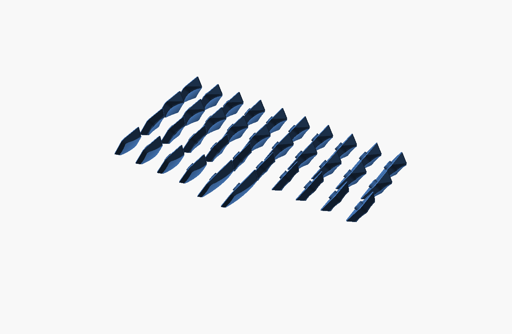

# KLP Lamé Angular (OpenSCAD)


KLP Lamé の特徴である「中央がくぼみ四辺が持ち上がる皿状の天面(前後のロールオフ)」を
保ちつつ、側面を**フラットで角のはっきりした台形**にした **角ばった・低背リミックス** です。
天面は元と同じ球面ディッシュ、側面はフラット、稜線だけを軽く丸めた「ラウンデッドボックス」構成。
OpenSCAD 製のフルパラメトリックモデルなので、寸法・形状を自由に調整できます。

An angular, lower-profile remix of KLP Lamé. Flat, crisp trapezoid
sides (a "rounded box" with only the perimeter edges softened) carry
the same spherical dish as the original — concave scoop rising toward
all four edges, rolling off over the front/back walls. Fully parametric
OpenSCAD source. Stem and cavity dimensions are measured from the
original STLs, so switch fit is identical to the originals.

## 特徴 / Features

- **角ばった形状** — 側面はフラットな台形、稜線のみ軽い丸め(上端 R1.0)
- **皿状の天面は維持** — 元と同じ球面ディッシュ(中央がくぼみ四辺へ約0.65mm持ち上がる)、
  前後はロールオフ。Tilted の 15° 傾斜もそのまま
- **低背化** — クラウン高さ 5.0 mm(オリジナル約 5.6 mm より低い)、
  指の当たる谷底は約 3.9 mm
- **互換ステム** — Choc(2本足 1.15×2.95、間隔5.7)/ MX(Ø5.5 ボス+十字)
  はオリジナル実測値そのまま
- **FDM向け** — Bambu Lab A1 mini でのプリントを想定(内側ボトムチャンファ付き)

## バリアント / Variants

オリジナルと同じ 7 種 × ステム(Choc/MX) × サイズ(Choc 17.5×16.5 / MX 18×18):

| Variant | 説明 |
| :--- | :--- |
| Normal | フラット+浅いくぼみ |
| Normal Homing | Normal+ホーミングバー |
| Normal Tilted | 15° 傾斜 |
| Thumb | 手前側を斜めにカット(親指用) |
| Saddle | 前後に丸く落ちる鞍型 |
| Saddle Homing | Saddle+ホーミングバー |
| Saddle Tilted | Saddle の 15° 傾斜版 |

ビルド済み STL は `STL/` 以下(`build.sh` で再生成できます)。
ホーミングは `homing = "dots"` でオリジナル風の3点バンプにも変更可能です。

## Corne v4 Mini 印刷セット / Print set

[c4mtb](https://github.com/iwmsl/c4mtb)(Corne v4 Mini 相当)向けの
**両手36キー一式**を、Bambu Lab A1 mini(180×180mm)にそのまま並べた
プレートを用意しています(`MX Stem + Choc Size`)。詳細は
[Plates/README.md](./Plates/README.md)。

| ファイル | 向き | 特徴 |
| :--- | :--- | :--- |
| `Plates/Plate_A1mini_Test_OneEach_MinContact.stl` | 各モデルで接地可能な最小の側面を下 | 9種を各1個。約56.6×55.5mm。まず試す用。8mmブリム推奨 |
| `Plates/Plate_A1mini_SideDown.stl` | 側面を下(横倒し) | 天面に積層痕が出ず手触り良好。サポート要(推奨) |
| `Plates/Plate_A1mini_BottomDown.stl` | 底面を下(上向き) | 配置が単純。天面は積層痕が出る。サポート＋ブリム推奨 |

試作版の内訳: Normal / Normal Homing / Normal Tilted / Thumb / Saddle /
Saddle Homing / Saddle Tilted / 1.5U Normal / 1.5U Thumb Slope を各1個。

36キー版の内訳: Normal Tilted×20 / Normal×8 / Normal Homing×2 /
Thumb(1U)×4 / 1.5U Thumb Slope×2 = 36。



## 使い方 / Usage

### OpenSCAD GUI(カスタマイザ)

`klp-lame-angular.scad` を開いて Customizer からパラメータを変更し、
F6 → STL エクスポート。主なパラメータ:

| パラメータ | 既定値 | 説明 |
| :--- | :--- | :--- |
| `stem_type` | choc | choc / mx |
| `size_type` | choc | choc (17.5×16.5) / mx (18×18) |
| `variant` | normal | normal / tilted / thumb / saddle / saddle_tilted |
| `homing` | none | none / bar / dots |
| `crown_height` | 5.0 | クラウン(天面の外周稜線)の高さ ※ |
| `dish_depth` | 1.15 | 中央のくぼみ深さ。谷底 = `crown_height` − `dish_depth` |
| `dish_radius` | 28 | 球面ディッシュのR(小さいほど深く丸い皿) |
| `top_inset` | 2.0 | 側面の傾き(1辺あたりの天面の縮み) |
| `top_edge_round` | 1.0 | 上端稜線の丸め |
| `corner_radius` | 1.9 | 底面の角R(小さいほど角ばる) |
| `tilt_angle` / `tilt_front_height` | 15 / 4.0 | Tilted の傾斜角と前端高さ |
| `saddle_depth` / `saddle_radius` | 1.5 / 20 | Saddle の前後谷の深さ・R |

※ 谷底(`crown_height` − `dish_depth`)− 空洞深さ(約2.0)が天板の最小厚です。
既定値で約 1.85 mm。FDM なら 1.0 mm 以上を推奨します。

### CLI

```sh
# 単品
openscad -o cap.stl -D 'stem_type="choc"' -D 'variant="saddle"' klp-lame-angular.scad

# 全28種 + プレビュー画像
./build.sh
```

## Bambu Lab A1 mini での印刷 / Printing

側面がフラットなので **横倒し(左右どちらかの側面を下)** が印刷しやすく、
天面の積層痕も目立ちにくいです。オリジナル同様の 45° 傾けでも構いません。
試作プレートでは左右固定ではなく、4つの外側面をモデルごとに解析し、
実際に接地できる平面のうち面積が最小の面を下にしています。

- ノズル: 0.4 mm / レイヤー: 0.08–0.12 mm
- 壁: 4 以上、インフィル: 100%(小さい部品なのでほぼ変わりません)
- 向き: 側面を下にして横倒し(サポートはステム足周辺のみ、ツリーサポート推奨)
- 試作プレート: 接地面が小さいため8mmブリム推奨
- 材料: PLA / PETG(テクスチャPEIプレート)
- シーム: 後方に寄せる(Seam position: Rear)
- はめ合いがきつい/ゆるい場合: Bambu Studio の
  「X-Y hole compensation」を ±0.05 mm 程度調整するか、
  scad の `choc_leg_w` / `mx_slot_v` などを直接調整

レジン印刷でも問題ありません(その場合 `foot_chamfer` は 0 でも可)。

## クレジット / Credit

Original KLP Lamé by [braindefender](https://github.com/braindefender/KLP-Lame-Keycaps).
This remix follows the same license — keep the credit to the original author.
